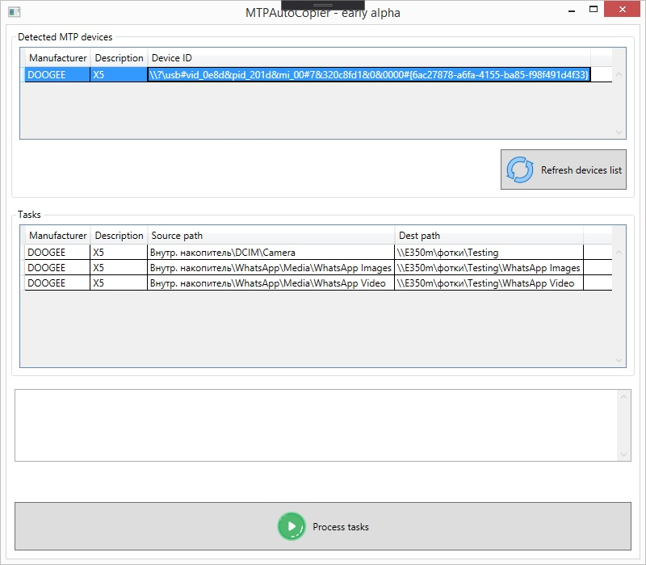

# MTPAutoCopier

Desktop application for automated copying files from MTP devices (phones, tablets, cameras) to PC or network path.

 

Program is under lazy slow development. Minimally working version can be found in develop branch.
Currently program can work only with manually prepared config file, and you can't create tasks in it.

